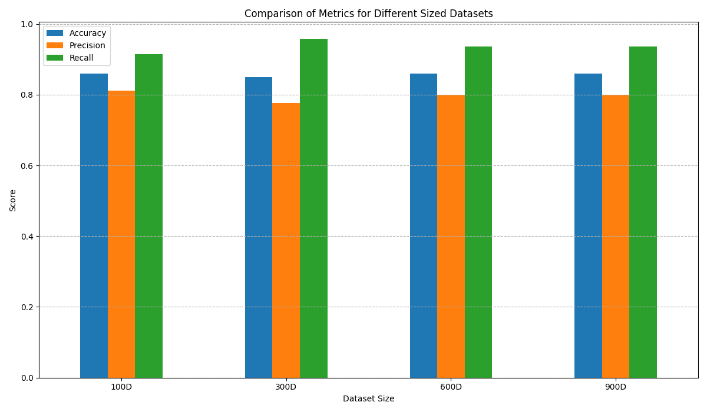
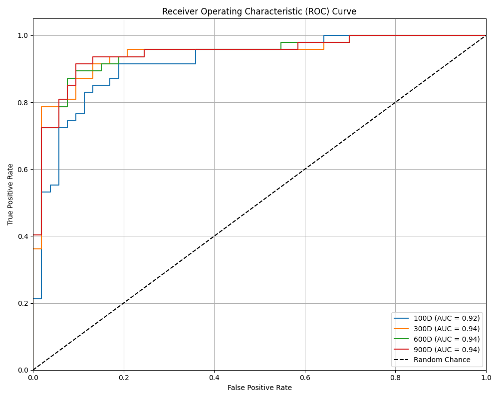

# 🩺 Heart Disease Prediction with Naive Bayes

A machine learning project to predict heart disease using the Gaussian Naive Bayes algorithm. This project compares model performance across datasets of different sizes and visualizes the results.

---

## 📁 Project Structure

```
e:\ML- NAIVE BAYES\
│
├── nb_analysis.py
├── 100D_heart_disease_dataset.csv
├── 300D_heart_disease_dataset.csv
├── 600D_heart_disease_dataset.csv
├── 900D_heart_disease_dataset.csv
├── 100D_test_dataset.csv
├── metrics_comparison.png
└── roc_curve_comparison.png
```

---

## 🚀 Features

- Trains and evaluates a Naive Bayes classifier on multiple dataset sizes
- Compares **Accuracy**, **Precision**, **Recall**, and **AUC**
- Visualizes results with bar charts and ROC curves
- Easy to run and extend

---

## 🛠️ Requirements

- Python 3.x
- pandas
- numpy
- scikit-learn
- matplotlib

Install dependencies:
```sh
pip install pandas numpy scikit-learn matplotlib
```

---

## 📊 Usage

1. **Place all CSV files in the project directory.**
2. **Run the analysis:**
    ```sh
    python nb_analysis.py
    ```
3. **View the results:**
    - `metrics_comparison.png` — Bar chart comparing metrics
    - `roc_curve_comparison.png` — ROC curves for each dataset size

---

## 📈 Example Outputs

### Metrics Comparison



### ROC Curve Comparison



---

## 📃 Results

The script prints the following metrics for each dataset size:
- **Accuracy**
- **Precision**
- **Recall**
- **AUC (Area Under Curve)**

---

## 📚 License

MIT License

---

> *This project is for educational purposes and uses open heart disease datasets.*
